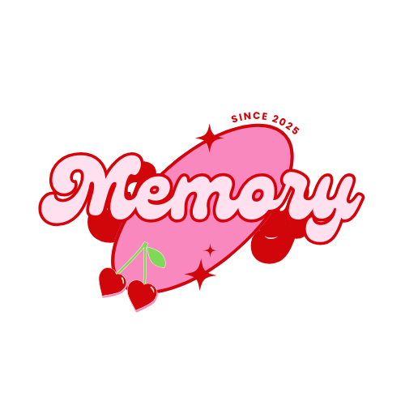

<!-- ⚠️ This README has been generated from the file(s) "blueprint.md" ⚠️-->

# ➤ 🌱 Memory - Student Mental Health App

  

## ➤ 📖 Overview
Memory is designed specifically for students as a complement to existing support systems. It provides students with an interactive mental health companion and a safe space for self-expression and emotional reflection. It combines journaling, AI-powered mood prediction, gamification, and self-care tools to create a supportive daily experience.

---

## ➤ ✨ Key Features

### 1. 🎭 Avatar Creation
- Students create their own avatar as a digital projection of themselves.  
- The avatar reacts to the user’s mood and activities, acting as a personal emotional projection.

### 2. 📝 Mood Journaling & Prediction
- Students write daily diary entries and select their mood.  
- AI combines today’s mood, diary content, and yesterday’s prediction to forecast tomorrow’s mood.

### 3. 🤖 LLM-based Companion
An AI chatbot acts as a friendly companion (disguised as a doll or plush character) and interacts with students.  
Example:  
- If the predicted mood is positive, the avatar encourages sharing joy when students open the app.  
- If the student feels sad, the avatar might initiate a comforting message.  
- The room environment also adapts (e.g., lights dim, rain outside the window).

### 4. 🏡 Interactive Room Environment
- The avatar’s room changes according to the student’s emotional state.  
- Example: clicking bed when tired → avatar encourages rest (“Today was a lot. It's okay to rest.”).

### 5. 🌱 Self-Care Journey & Rewards
- Small activities like meditation, breathing exercises, or white noise listening.  
- Completing tasks gives rewards that can be used to decorate the avatar’s room.

### 6. 🎮 Mini Games
- Bookshelf Sorting Game → promotes focus and relaxation.  
- Whack-a-Mole Game → stress relief and fun.  
Rewards from games can be spent on unlocking badges or cards.

### 7. 🏆 Positivity Leaderboard
- Encourages consistent engagement through healthy competition.  
- Example: leaderboard on self-care activities completed or rewards earned.

### 8. 📰 Daily Mental Health News
- Bite-sized updates about mental health awareness and coping strategies.

---

## ➤ 🛠️ Tech Stack

### 🎨 Frontend
- React Native (cross-platform mobile app)  
- Unity / Phaser.js (for avatar, interactive room, and mini-games rendering)

### ⚙️ Backend
- FastAPI (API server, user management, activity tracking)  
- MongoDB (database for storing user diaries, moods, rewards, leaderboard data, news)

### 🧠 AI & ML
- Python (ML core implementation)  
- NLP libraries:  
  - NLTK (English text preprocessing)  
  - Jieba (Chinese text segmentation)  
- ML models:  
  - Scikit-learn (Logistic Regression / Random Forest for mood prediction)  
- Optional PyTorch / TensorFlow (if moving to deep learning later)  
- LLM integration: OpenAI API or open-source LLM (for companion dialogue)

---

## ➤ 🏗️ Modules & Implementation

### 1. 🎭 Avatar Creation & Interactive Room
**Objective:** Provide an avatar and interactive environment that mirrors and responds to the student’s emotional state.  

**How to achieve:**  
- Avatar and room built with a 2D engine (eg. Unity / Phaser.js / Godot / React Native Canvas).  
- Room state dynamically changes based on mood prediction (e.g., variables: mood=happy → sunny scene, mood=sad → rain).  
- User interactions (e.g., clicking objects like bed or desk) trigger pre-set dialogues from the avatar.  

**Tech framework:**  
- React Native  
- Unity/Phaser.js
- FastAPI Backend  

---

### 2. 📝 Mood Prediction/Mood Journaling (ML Core)
**Problem:** Using users' daily diaries (text) + emotional tags assigned by users on the same day to predict ‘tomorrow's mood’. The objective is to enhance users' self-awareness and enable early intervention.  

**How to achieve:**  
- Users write a diary entry each day and select their mood.  
- The system processes the diary text into numerical features using NLP methods.  
- These textual features are combined with the mood tag of the same day and yesterday’s prediction as model input.  
- The model predicts the user’s mood for the following day.  
- On the next day, the user provides a new diary entry and mood tag. The system compares it with the prior prediction to refine and improve the model continuously.  

**Tech framework:**  
- FastAPI  
- MongoDB  
- Python NLP libraries  
- NLTK  
- Jieba (for Chinese text)  
- Scikit-learn (classification models such as Logistic Regression or Random Forest)  

---

### 3. 🤖 LLM-based Companion
**Objective:** Provide a conversational AI disguised as a doll/plush character to interact empathetically.  

**How to achieve:**  
- LLM integrates with predicted mood + today’s input.  
- Example behaviors:  
  - If predicted mood is good → initiate uplifting conversation.  
  - If predicted mood is low → proactively check in with comforting prompts.  
- Responses are contextualized using mood data + diary content.  

**Tech framework:**  
- FastAPI  
- OpenAI API or open-source LLM  

---

### 4. 🌱 Self-Care Journey & Rewards
**Objective:** Encourage daily wellness practices through gamified tasks and positive reinforcement.  

**How to achieve:**  
- Provide guided activities (e.g., meditation, breathing, white noise).  
- On completion, reward points are given.  
- Rewards can be spent on avatar’s room decoration.  

**Tech framework:**  
- React Native  
- FastAPI backend  
- MongoDB

---

### 5. 🎮 Mini Games
**Objective:** Provide casual mini-games that offer relaxation while reinforcing engagement.  

**How to achieve:**  
- Whack-a-Mole → fast stress relief.  
- Bookshelf Sorting → promotes focus and order.  
- Game rewards are tied into self-care economy for consistency.  

**Tech framework:**  
- Unity/Phaser.js 
- FastAPI backend  
- MongoDB

---

### 6. 🏆 Positivity Leaderboard
**Objective:** Encourage healthy competition and sustained engagement by rewarding positive habits.  

**How to achieve:**  
- Track completed self-care activities, mini-games, and daily journaling consistency.  
- Rank students on a leaderboard to visualize progress.  
- Focus on positive reinforcement (e.g., “Most Consistent Journaler” rather than “lowest rank”).  

**Tech framework:**  
- React Native  
- FastAPI backend  
- MongoDB

---

### 7. 📰 Daily News
**Objective:** Provide short, accessible mental health updates to raise awareness and promote self-care education.  

**How to achieve:**  
- Curate bite-sized daily news about mental health, stress management, or positive psychology.  
- Display content in-app, integrated into the user’s daily flow (e.g., after journaling or completing tasks).  

**Tech framework:**  
- React Native  
- FastAPI backend  
- MongoDB

---

## 👥 Contributors

<table>
  <tr>
    <td align="center">
      <a href="https://github.com/aidasakinah">
         
        <b>Aida Sakinah binti Kahirol</b>
      </a>
    </td>
    <td align="center">
      <a href="https://github.com/devxous">
         
        <b>Tammy Wong Ee Xien</b>
      </a>
    </td>
    <td align="center">
      <a href="https://github.com/ae1207">
         
        <b>Muhammad Eusoff</b>
      </a>
    </td>
    <td align="center">
      <a href="https://github.com/KMingDa">
         
        <b>KERK MING DA</b>
      </a>
    </td>
  </tr>
</table>

